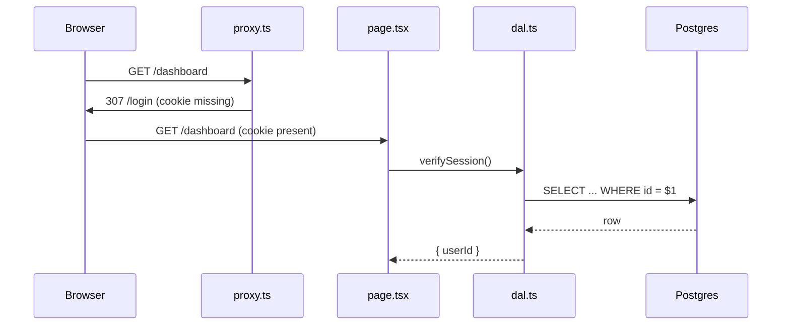

# Explanation templates, filled in

## Contents
1. Architecture decision record
2. Design doc
3. Change brief
4. Trade-off table
5. Review comments
6. Delivery structures
7. Diagrams in text
8. A worked end-to-end example

---

## 1. Architecture decision record

```markdown
# Use database sessions rather than stateless JWT cookies

## Status
Accepted

## Context
The app needs "log out all devices" for an enterprise customer, and a compliance requirement calls for
revoking access within 60 seconds of an admin action. Stateless sessions cannot be revoked before expiry
without a blocklist, which is a database read on every request anyway.

## Decision
We will store sessions as rows in Postgres and put only an encrypted session ID in a `__Host-` cookie.

## Consequences
Easier: instant revocation, concurrent session limits, last-login tracking, one place to audit.
Harder: one database read per authenticated request, so the sessions table needs an index on the ID column and
a cleanup job for expired rows. A database outage now logs everyone out rather than degrading gracefully.
```

Present-tense imperative title. Immutable once accepted: a reversal is a new record that supersedes this one.

## 2. Design doc

Section order, which is also the order of decreasing reader patience:

1. **Context and scope** - objective background only, no advocacy.
2. **Goals and non-goals** - non-goals are things that could reasonably be goals and were deliberately
   excluded. This is where "what we are not doing" lives, as a falsifiable claim.
3. **The actual design.**
4. **Alternatives considered** - why the selected solution is best given the goals, and how each alternative
   trades off worse against those same goals.
5. **Cross-cutting concerns** - security, privacy, cost, observability.

## 3. Change brief

```
Replace the layout-level auth check with per-action verification

The dashboard layout called verifySession() and every nested route assumed that gated it. Layouts do not
re-render on client-side navigation, and they do not gate Server Actions defined in the subtree, so
deletePost and updateSettings were reachable by a direct POST from any authenticated user.

Every action now calls verifySession() itself and compares the resource owner to the session user. The
layout check stays as a redirect UX affordance only.

Not done: the /api/export route handler still authenticates but does not authorize per row. Tracked in #412.
Not verified: I did not test the parallel-route slots under a revoked session.

Gates: tsc 0, eslint 0, vitest 41 passed, playwright 14 passed.
```

First line imperative and standalone. Body: problem, approach, shortcomings. Then what was not done and what
was not verified, explicitly.

## 4. Trade-off table

Rows are options including "do nothing". Columns are the goals that decide it. Every cell is a claim, not an
adjective.

| Option | First byte at p75 | Ops burden | Cost at 1M req/day | Reversible |
|---|---|---|---|---|
| Cache at the CDN edge | ~40ms | invalidation strategy required | included in the plan | yes, flip a header |
| Cache in the app with tags | ~120ms | tag hygiene, multi-instance invalidation | none | yes |
| No cache | ~380ms | none | database load scales linearly | n/a |

Below the table, one sentence naming the chosen row and the specific loss accepted with it.

## 5. Review comments

```
issue (blocking): src/actions/post.ts:31
  deletePost reads postId from the client and deletes without checking ownership. Any authenticated user can
  delete any post. Compare post.authorId to session.userId before the delete.

suggestion (non-blocking): src/lib/dal.ts:12
  getUser selects every column. Narrowing to id, name, email would stop the raw row from reaching a client
  component if someone passes it down later.

question: src/proxy.ts:8
  Is the nonce CSP intended here? This route is statically generated, and a nonce needs a per-request render.

praise: tests/auth.spec.ts
  The revoked-session case is exactly the test that would have caught the bug above.
```

Labels: `praise`, `nitpick`, `suggestion`, `issue`, `todo`, `question`, `thought`, `chore`, `note`. Decorate
with `(blocking)` or `(non-blocking)` so the author knows what gates the merge. `nitpick`, `thought`, and
`note` are always non-blocking.

## 6. Delivery structures

| Structure | Use when | Core move |
|---|---|---|
| BLUF | The reader must act | Conclusion or ask in sentence one |
| Inverted pyramid | The reader skims for facts | Most important fact first, expendable tail |
| Anecdotal lede plus nut graf | The reader must be earned | A scene, then "why you are reading this" within the first 10 to 15 percent |
| SCQA | The reader must be persuaded | Situation, complication, question, answer; the reader reaches the question one beat before the answer |
| PEEL | A graded analytical argument | Point, evidence, explanation, link. The explanation is where writing collapses into "this shows that"; name the actual mechanism instead |
| XYZ | Bullets scanned in six seconds | "Accomplished X, measured by Y, by doing Z" |
| Ladder of abstraction | The topic is inherently abstract | Never stay abstract more than one or two sentences; drop to a name, a number, or an object |

## 7. Diagrams in text

Mermaid is the default for a Claude Code workflow: plain text, renders in GitHub and in VS Code with the
extension, generated inline without a rendering round trip.



ASCII boxes are the fallback where Mermaid will not render, such as a terminal or a plain-text log.

Choose by content: a diagram wins for topology, flow, or hierarchy (call graphs, state machines, directory
trees); a table wins for comparing more than two discrete dimensions. Do not force a flowchart onto a
comparison, or a table onto a sequence.

## 8. A worked end-to-end example

Question from the user: "Why is the dashboard slow?"

Level 1, stands alone:

> The dashboard's LCP is 4.1s at p75 on mobile, and 2.9s of that is resource load delay: the hero chart's data
> is fetched in a client effect after hydration, so the browser does not know the chart exists until the JS has
> parsed and run. Moving that fetch into the Server Component drops the delay to roughly the TTFB.
> `[VERIFIED: web-vitals attribution build, 7 days of field data]`

Level 2, only if asked:

> LCP breakdown at p75: TTFB 0.7s (within the 40 percent guideline), resource load delay 2.9s (should be under
> 10 percent), load duration 0.3s, render delay 0.2s. The chart component is `'use client'` at the route root
> rather than at the leaf, so 184 KB of First Load JS parses before the fetch even starts.
> `[LOAD-BEARING: this assumes the chart library can render server-side; it holds unless the library requires
> a browser canvas at import time, which I did not check.]`

There is no level 3. If the reader needs more, they will ask a specific question, and that question is a
better guide than a preemptive third level.
